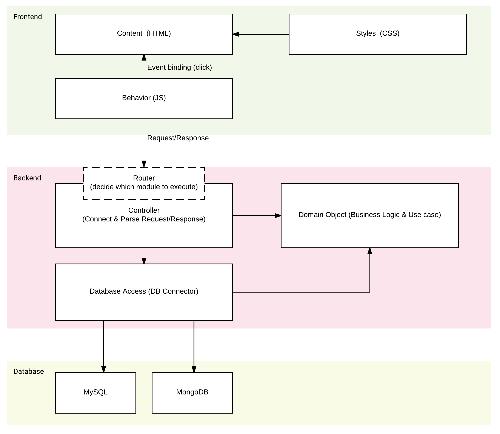
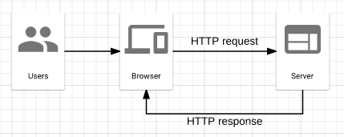

# Introduction

## Agenda

### Lecture

* Syllabus
* Overview
* Suggested development environment
* Basic HTML & CSS
* Basic Component (Button, Form, Table, Image)

> Detail HTML & CSS to come next week

### Lab

* Java set up
* Git/Github set up
* Development environment
* Deploy Components to Github page


## Syllabus

Go to [Syllabus.md](../SYLLABUS.md) for detail.

## Overview


Hello! Welcome to the web programming course!

In this class, we will have a lot of fun building things together. Specifically,
we will be building a restaurant application, or so called project, throughout
the entire semester.

### What is web application?

Web application exists everywhere nowadays. E.g. you are actually looking an
example of the web application right now while you are reading the lecture notes
(Github).

### Why is it important?

Web applications are easy to distribute to end users and it's considered to have
lower cost in development. And it's highly available to large amount of users
(as long as they have internet).

### What are we learning in this class?

We will be learning how to build server web applications from the front-end to
back-end and potentially to some server operations all in one class. I'll expect
students to know how to build an application from the start to the end!

However, this class isn't really specialized in any of the fields. By the end of
this class, you may know enough of the everything to get started. If you wish,
you may still learn more in the field you would like. See [developer road map][1]
for checking out possible routes.

### Overall web architecture

Before we start talking the technical details, lets step back a bit to look at
overall architecture for web applications.



At top level, we can split web applications into simplest three layers -- front-end,
back-end & database.

**Why is it these three?**

Most of time, you will run your web applications across different machines based
on these three layers. Front-end is usually running on the customers' environment
(whether a mobile phone, desktop, laptop or any other devices). Think of it as
an application that runs in the user browser (Chrome). Back-end, on the other hand,
is usually running on some sort of servers (whether it's on the cloud or some
machines). Since the user doesn't interact with the server directly, it means you
have a lot more control on the server and allows you to do many different things,
including security related stuff and so on. While the database is usually 
separated from the back-end due to the fact you want data to be available 
regardless of the server state. In example, you may restart your web server for
deployment and you definitely don't want to lose data because you shut down the
server.

In short, these three are the simplest layers in web application architecture 
because they are usually running on different environment. Thus, they each serves
different purposes and are designed differently.

### How the web works

But then, how does the front-end application communicate to the server.
Fortunately, this communication has been standardized by HTTP (Hypertext Transfer
Protocol). You may check out [this wiki article] for more detail.

In short, HTTP works in this way.



In specific, user may use browser like Chrome to **request** information from the
server and server **responses** with information based on the user request.

You may ask, how does server know what information user is requesting for?

One of the first information browser has to send is URL (Uniform Resource Locator)
to server. In fact, this URL may go through a lot of servers before it reaches to
designated server (e.g. go through DNS servers to find out which server to send).

For how DNS works, you can check out this comic -- https://howdns.works/ep1/

### URL

URL is spec'ed into several parts:

* protocol
* host name/ip
* path

Take this URL for example: https://github.com/csula/cs3220-summer-2017

Protocol being `https` and host name being `github.com` while path being
`csula/cs3220-summer-2017`

Sometimes you may see port being included with the host name. e.g.

http://github.com:80/csula/cs3220-summer-2017

For most of time, you don't see port because the port 80 is the default port.
However, once a while (especially in your own development environment), you may
see port included in the URL.

### HTML

Stands for HyperText Markup Language.

```html
<html>
	<head>
		<title>CS 3220</title>
		<link rel="stylesheet" type="text/css" href="styles.css">
	</head>
	<body>
		<h1>Hello world!</h1>
	</body>
</html>
```

HTML is the most basic building block for the web. It's a language to describe
to browser what to display. Briefly speaking, it contains tag & attributes.

Tag being like `<html>` usually have its opening and closing tag `</html>`.

Attribute being like `rel="stylesheet"` usually within the opening part of the 
tag and it has its name and value (while value being surrounded by double quote).

### Summary of web

Again, web client like browser sends a request to a certain URL. Server receives
the URL and determine what information to return to client (simplest case will
be described in HTML so that browser can render information).

## Suggested Development Environment

Since majority of the class will be laboratory, I want to help everyone set up
their development environment as early as possible.

### Utilities

* [Git](https://git-scm.com/downloads)

> Please. Windows users, download Git and use the Git bash than windows command
line.

### Text Editor

* [VS Code](https://code.visualstudio.com/)
* [Sublime Text](https://www.sublimetext.com/)
* [Vim](http://www.vim.org/download.php)

### Java

https://github.com/csula/Utilities/blob/master/setups/java-gradle-setup.md

### Java IDE

* [IntelliJ](https://www.jetbrains.com/idea/)
* [Eclipse](https://eclipse.org/)


> Seriously though, use whatever IDE you want.

## Basic HTML & CSS

### DOM

### DOM Tree

### Selector

## Basic Components

### Button

**html**

```html
<button>This is a button</button>
```

**css**

```css
button {
	background-color: #333;
	color: #fff;
	padding: 0.5em 1em;
}
```

### Form

**html**

```html
<label for="name">Name</label>
<input id="name" type="text" />

<label for="age"></label>
<input id="age" type="number" />
```

**css**

```css
label {
	font-size: 0.8em;
	font-color: #333;
}

input {
	font-size: 16px;
	padding: 0.5em 1em;
}
```

### Table

**html**

```html
<table>
	<thead>
		<tr>
			<th>Name</th>
			<th>Price</th>
		</tr>
	</thead>
	<tbody>
		<tr>
			<td>Hambuger</td>
			<td>$15.99</td>
		</tr>
	</tbody>
</table>
```

### Multimedia (image)

```html

```

[1]:https://github.com/kamranahmedse/developer-roadmap
[2]:https://en.wikipedia.org/wiki/Hypertext_Transfer_Protocol
