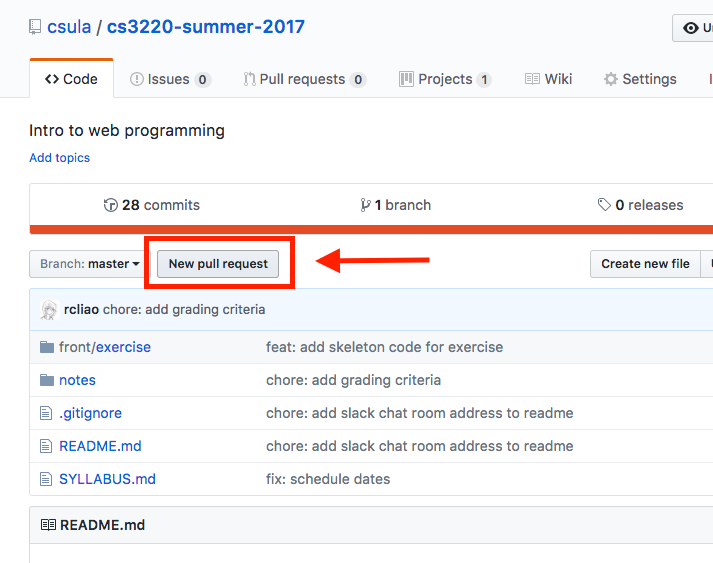
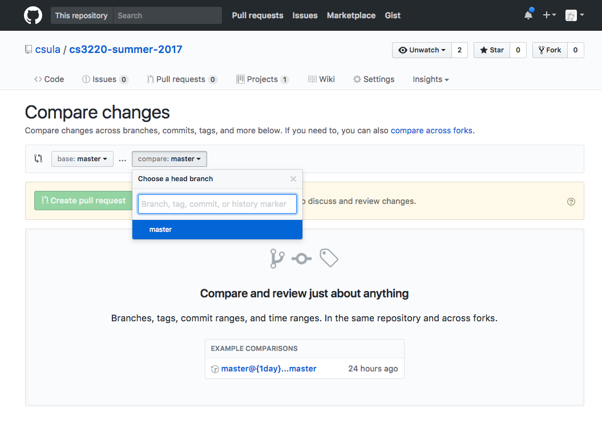

# Lab Submission Guidelines

## Brief Context

Personally, I found the Github workflow to be extremely useful and 
intuitive to follow; thus, in class, I enforce students to follow Github
workflow if possible for homework and labs.

See https://guides.github.com/introduction/flow/ for how Github explains
workflow.

Or you can simply follow the remaining section of this article to follow
Github workflow for class.

## Recording

[](https://asciinema.org/a/0vis8x47iibnfgr93svbffhgmn)

## Set up

Before you start any lab, please always start from a new branch. To start
on a new branch:

```sh
# -b flag tells git to create branch if the "branch-name" doesn't exist
git checkout -b branch-name
```

To switch between branches:

```sh
# Usual checkout without the flag is switching to existing branches
git checkout branch-name
```

## Commit changes

After you made some changes, you want to commit changes on Git. You can follow the following commands:

```sh
# -a flag tells Git to include all changes all at once
# -m flag tells Git to use the following argument as commit message
git commit -a -m "Commit message"
```

## Pushing local changes to Github

Note that all the commits you've done above only exists locally (in your 
computer); therefore, it is important for you to push changes onto Github
server so that I can see your changes accordingly.

To do so:

```sh
# origin is Github (by default)
# branch-name is which branch you are pushing to
git push origin branch-name
```

## Open pull request

To open pull request, you can click on the pull request button on the top 
right of Github:




And then you can enter the proper description in the Github pull request
and click on open pull request.

